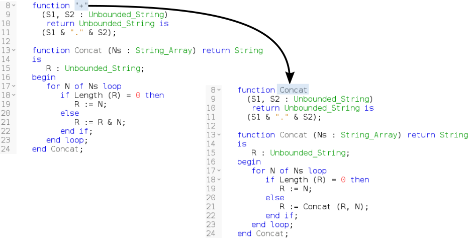
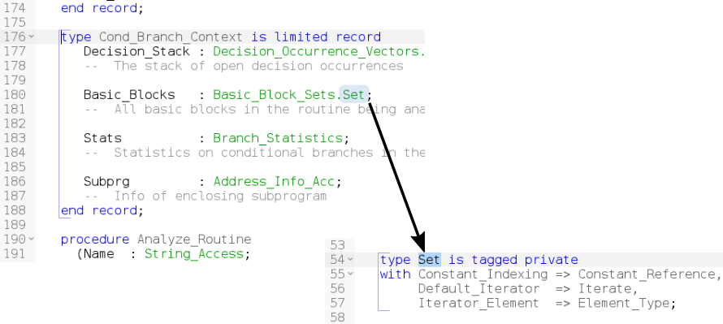
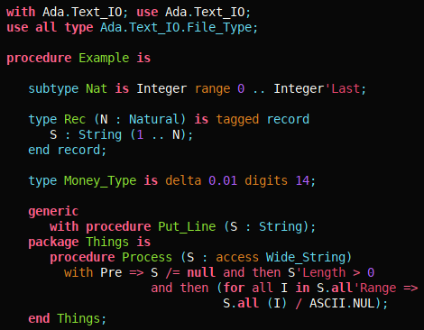

---
author:
- Pierre-Marie de Rodat
- Raphaël Amiard
title: Easy Ada tooling with Libadalang
titlepage-note: |
 Title notes...
institute: Software Engineers at AdaCore
theme: metropolis
...

## The need

### In three bullet points

- A library that allows users to query data about Ada sources
- Syntactic and semantic information
- Both low level and high level information
- Should be easy to integrate into tools/IDEs from different
  platforms/languages/etc.

## The need - IDEs

{ width=70% }

## The need - IDEs

{ width=90% }

## The need - IDEs

{ width=90% }

## The need - command line tools

```ada
procedure Main is
   type my_int is new Integer range 1 .. 10;
   Var : my_int := 12;
begin
   null;
end Main;
```

```bash
$ ./my_custom_lal_checker main.adb

main.adb:2:9: Variable should start with lowercase letter
main.adb:3:4: Type name should start with uppercase letter
```
## Why not ASIS/GNAT?

### Challenges

- Incremental: don't recompute everything when the code changes
- Error recovery: ability to compute partial results on incorrect code
- Long running: be able to run for 3 days without crashing your machine

GNAT and AdaCore's ASIS implementation are ill suited to those challenges.

## Design goals

- Multi-language: Easy binding generation to other languages/ecosystems
    * Today: Python, Ada, C

- Easy scripting: Be able to create a prototype quickly & interactively

- Both low & high level APIS:
    * What is the type of this expression?
    * How many references to this variable?
    * Give me the source location of this token
    * Rename this entity
    * Etc.

## API Part 1: Tokens

```python
ctx = lal.AnalysisContext()
unit = ctx.get_from_file('main.adb')
for token in unit.root.tokens:
    print('Token: {}'.format(token))
```

## API Part 2: Syntax

```python
for object_decl in unit.root.findall(lal.ObjectDecl):
    print(object_decl.text)

```

## API Part 3: Semantic

```ada
with Ada.Text_IO; use Ada.Text_IO;

procedure Main is
    function Double (I : Integer) return Integer is (I * 2);
    function Double (I : Float) return Float is (I * 2.0);
begin
    Put_Line (Integer'Image (Double (12)));
end Main;
```

```python
double_call = unit.root.find(
    lambda n: n.is_a(lal.CallExpr) and n.f_name.text == 'Double'
)

print(double_call.f_name.p_referenced_decl)

```

## API Part 4: Tree rewriting

> WARNING: Not done yet

```python
diff = ctx.start_rewriting()

# Get the first parameter of the call to Double
param_diff = diff.get_node(double_call.f_suffix[0])

# Replace the expression of the parameter with a new node
param_diff.f_expr = lal.rewriting.RealLiteral('12.0')

diff.apply()
```

## An example

```python
import sys
import libadalang as lal

def check_ident(ident):
    if ident.text[0] != ident.text[0].upper():
        print('{}:{}: variable name "{}" should be capitalized'.format(
            ident.unit.filename, ident.sloc_range.start, ident.text
        ))

ctx = lal.AnalysisContext()
for filename in sys.argv[1:]:
    u = ctx.get_from_file(filename)
    for d in u.diagnostics:
        print('{}:{}'.format(filename, d))
    if u.root:
        for decl in u.root.findall(lal.ObjectDecl):
            for ident in decl.f_ids:
                check_ident(ident)
```

# Technical prototypes/demos

## Syntax highlighter/Xref explorer

{ width=90% }

## Syntax based static analyzers

```python
def has_same_operands(binop):
    def same_tokens(left, right):
        return len(left) == len(right) and all(
            le.is_equivalent(ri) for le, ri in zip(left, right)
        )
    return same_tokens(list(binop.f_left.tokens), list(binop.f_right.tokens))

def interesting_oper(op):
    return not op.is_a(lal.OpMult, lal.OpPlus, lal.OpDoubleDot,
                       lal.OpPow, lal.OpConcat))

for b in unit.root.findall(lal.BinOp):
    if interesting_oper(b.f_op) and has_same_operands(b):
        print 'Same operands for {} in {}'.format(b, source_file)
```

Those 20 lines of code found 1 bug in GNAT, 3 bugs in CodePeer, and 1 bug in
GPS (despite extensive testing and static analysis).

More info [on our blog](http://blog.adacore.com/going-after-the-low-hanging-bug)

## Semantic based static analyzers

TODO: fill when Romain sends

## Copy paste detector

## Applications

- Inside Adacore: change semantic engine in GPS, new versions of GNATmetric,
  GNATStub, GNATpp
- Outside: clients using it in production for various needs such as:
    * Code instrumentation
    * Automatic refactorings
    * Generation of serializers/deserializers

## Conclusion

- Sources are on [GitHub](https://github.com/AdaCore/libadalang)
- Come open issues and create pull requests!
- API is still a moving target
